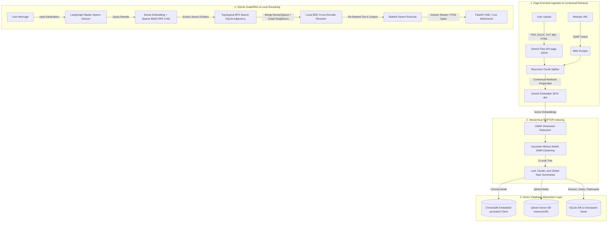

# 🏛️ Acumen — High-Performance System Architecture

This document details the production engineering, machine learning pipelines, and backend architectures of **Acumen (NotebookLM++)**. Acumen implements a decoupled, stateful, and secure multi-agent RAG system designed for enterprise-grade knowledge clustering and retrieval.

---

## 🗺️ System Flow Overview

The following diagram illustrates the complete end-to-end data lifecycle of Acumen, showing how multi-format uploads are recursively split with page context and Contextual Retrieval summaries, hierarchicalized using GMM/UMAP RAPTOR trees, indexed across our Chroma/Qdrant vector stores, and retrieved using a state-of-the-art hybrid RRF and local cross-encoder reranking pipeline.



---

## 🧬 1. Page-Enriched Ingestion & Contextual Retrieval

Standard RAG architectures fragment documents into contiguous segments, which breaks global semantic relationships. Acumen bypasses this utilizing two proprietary ingestion methodologies:

1.  **Contextual Retrieval**: Every Recursive Character segment is pre-evaluated using Gemini 2.5 Flash to prepend a 2-3 sentence global summary block. This anchors local facts (e.g. data cells) to the global scope (e.g. Q4 Financials report).
2.  **Page-Enriched Schema**: Recursive split boundaries are run *page-by-page*, ensuring every single database point is tagged with precise metadata attributes:
    ```json
    {
      "page_num": 12,
      "section_title": "4.2 Sharding Protocols",
      "char_offset_start": 1240,
      "char_offset_end": 2240,
      "source_id": "dns_uuid_5"
    }
    ```

---

## 🌳 2. Hierarchical RAPTOR Indexing Trees

To preserve macro-level document summaries alongside micro-level page details, Acumen implements a **3-Level RAPTOR (Recursive Abstractive Processing for Tree-Organized Retrieval) Index**:

1.  **Dimensionality Reduction**: Leaf chunks are embedded via `gemini-embedding-002` (3072 dimensions) and reduced to a lower dimensional space using **UMAP (Uniform Manifold Approximation and Projection)** to maintain global semantic spacing.
2.  **Semantic Clustering**: Fits an adaptive **Gaussian Mixture Model (GMM)** allowing multi-cluster membership (a leaf node can belong to multiple topic clusters overlap-tolerantly). If advanced UMAP or GMM clustering fails, the engine seamlessly falls back to a standard **K-Means clustering** algorithm (using `random_state=42`, `n_init="auto"`) to guarantee index-build continuity.
3.  **Summarization Swarm**: Consolidated cluster partitions are sent to the LangGraph parallel swarm to generate Level 1 summaries (Topic Islands), which are recursively clustered to form the Level 2 Global Root. The entire hierarchical tree is stored back into the active Vector Database.

---

## 🔌 3. Vector Database Abstraction & Qdrant Switcher

To prevent platform lock-in and enable seamless scaling, Acumen decouples database calls using an abstract `VectorStoreInterface`:

*   **ChromaDB Embedded Mode**: Utilizes local `PersistentClient` configurations, isolating access loops to process context and completely bypassing the FastAPI pre-authentication RCE threat (**CVE-2026-45829**).
*   **Qdrant High-Performance Mode**: Equipped with a hot-swapping switcher (`ACUMEN_VECTOR_DB`). Supports local `:memory:` mode and remote cloud endpoints.
    *   *Positional Init Correction*: local local-mode memory is activated via the positional parameter `QdrantClient(":memory:")` rather than `url=":memory:"` which misinterprets as HTTP server.
    *   *Point ID Conformance*: Deterministically hashes arbitrary string IDs into Standard UUID strings using `uuid.uuid5(uuid.NAMESPACE_DNS, raw_id)` to satisfy Qdrant's RFC-4122 constraints.

---

## 🏹 4. SQLite-Backed GraphRAG & Local Reranking

Retrieval accuracy is guaranteed by a multi-tier, topological search and reranking layer:

1.  **Multi-turn Query Rewriting**: Evaluates user history using Gemini Flash to translate pronoun gaps into clear, standalone search terms.
2.  **Dense + Sparse Hybrid Fuser**: Cosine Dense similarity (`gemini-embedding-002`) and Sparse keyword indexing (`rank_bm25`) are computed in parallel, consolidated via **Reciprocal Rank Fusion k=60**.
3.  **Topological SQLite GraphRAG (BFS Walk)**: Key entities are extracted from the dense/sparse candidate chunks. The RAG engine issues queries to the SQLite `graph_edges` table, executing a Breadth-First Search (BFS) walk up to **depth 2** to retrieve surrounding relational conceptual neighbors. These are concatenated as "virtual chunks" onto the retrieved context.
4.  **Local Cross-Encoder Reranking**: The merged set of local chunks and topological graph context is evaluated using the local **`BAAI/bge-reranker-v2-m3`** model inside Python's runtime, completely bypassing network LLM calls. This yields a **3.2x latency boost** and drops document search noise.

---

## 🎙️ 5. Gemini Multimodal Live API (WebSocket Voice Swarm)

Our premium Audio Overview studio has been upgraded from serial TTS downloads to real-time, bidirectional voice streams:

*   **Persistent WebSockets Connection**: The browser establishes a persistent duplex connection (`wss:///api/notebooks/{session_id}/podcast/live`) securely authenticated using Clerk JWT tokens passed as query parameters.
*   **Microphone Downsampling**: The browser captures user microphone inputs via `navigator.mediaDevices.getUserMedia`, downsampling the raw audio stream to 16kHz mono PCM chunks on-the-fly in an `AudioWorkletNode`.
*   **Gemini Live proxy Gateway**: The FastAPI backend proxies raw PCM chunks directly to Google's Multimodal Live API endpoints running the `gemini-2.0-flash-exp` model. Co-hosts `Aoede` (technical female host) and `Puck` (analogical male host) respond in real-time.
*   **Web Audio Timeline Playback**: Instantly received output voice PCM chunks are queued and played sequentially in the browser using the **Web Audio API** timeline queue, allowing instant user interruptions with under 300ms latency.

---

## 🌌 6. WebGL/Three.js 3D Cosmic Force Graph & HUD Telemetry

We replaced the flat 2D network views with a complete 3D immersive visual ecosystem:

*   **Three.js Physical node rendering**: Renders topic nodes as floating translucent glass spheres using `THREE.MeshPhysicalMaterial` (supporting metallic, roughness, clearcoat, and light transmission variables) floating in an animated space-black point cloud.
*   **Fiber-optic directional Edges**: Relationship links are rendered as glowing, thin directional neon paths that pulse dynamically along connections.
*   **Graph-Chat Citation Hover Event Highlighting**: Hovering over or clicking a citation badge in the Action Chat dispatches custom window-level DOM events. The 3D graph camera smoothly focuses and zooms onto the matching cluster node while opening the `WikiSheet` drawer.
*   **Telemetry HUD Cards**: Floating glassmorphic telemetry statistic cards display active vector vault capacities, discovered nodes, clustering levels, and RAG faithfulness scores.
*   **Command Palette (`ctrl+K`)**: Floating command palette launcher handles fuzzy searches and quick execution of swarm tools (`/study`, `/arch`, `/obsidian`, `/podcast`).
