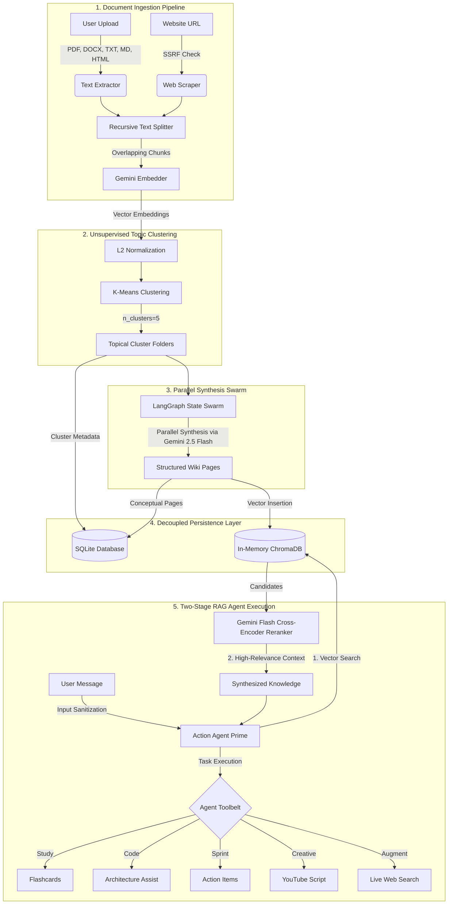

# 🏛️ Acumen — High-Performance System Architecture

This document details the software engineering and machine learning architecture of **Acumen (NotebookLM++)**. Acumen implements a highly decoupled, stateful, and secure multi-agent RAG pipeline optimized for deployment on resource-constrained cloud environments (e.g., Render Free Tier and Vercel).

---

## 🗺️ System Flow Overview

The following diagram illustrates the complete end-to-end data lifecycle of Acumen, from initial multi-format document/URL ingestion through unsupervised clustering, parallel synthesis swarms, persistence, and two-stage RAG-augmented agent execution.



---

## ⚡ 1. Ingestion & Unsupervised Machine Learning Pipeline

Standard RAG architectures split documents into uniform, contiguous chunks and load them directly into vector databases. This introduces "fragmentation loss," where concepts spanning multiple pages are disconnected. Acumen solves this using unsupervised clustering:

1. **Text Extraction**: Modular extraction layers dynamically read stream bytes for PDFs (`pypdf`), Word documents (`zipfile`/`xml`), HTML (`BeautifulSoup`), plain text, and web URLs.
2. **Recursive Chunking**: Document strings are parsed into $1000$-character chunks with a $150$-character overlapping safety boundary.
3. **High-Dimensional Embedding**: Every chunk is mapped to a 768-dimensional space via `gemini-embedding-001`.
4. **L2 Normalization**: Embedding vectors are normalized to unit sphere length ($\|x\|_2 = 1$). This converts Euclidean distance into an accurate proxy for Cosine Distance.
5. **K-Means Clustering**: The backend fits a spherical $K$-Means model ($n=5$ topic centroids, `random_state=42`) using `scikit-learn`.
6. **Topical Partitioning**: Chunks are regrouped into mathematical "islands of context" (topic clusters), mapping fragments by conceptual relevance rather than linear page order.

---

## 🧬 2. The Synthesizer Swarm (LangGraph)

Once documents are clustered, Acumen boots a specialized **LangGraph Parallel Swarm** to process the mathematical topics in parallel:

* **State Swarm**: A coordinated multi-node graph loops through each independent cluster.
* **Topic Synthesis**: Each cluster's consolidated chunks are synthesized by **Gemini 1.5 Flash** into an structural, cohesive knowledge resource called a **Wiki Page**.
* **Output Schema**:
  ```json
  {
    "cluster_id": 0,
    "topic_title": "Database Scalability & Sharding Protocols",
    "summary": "Cohesive summary of the clustered database concepts...",
    "key_terms": ["horizontal partitioning", "consistent hashing"],
    "insights": ["Sharding introduces cross-node join complexity..."]
  }
  ```
* **ChromaDB Injection**: The synthesized pages are tokenized and injected into an in-memory `chromadb` collection (`acumen_wiki`), capturing semantic boundaries cleanly.

---

## 🧠 3. Stateful Two-Stage RAG Execution

To guarantee lightning-fast response times and high accuracy, the **Master Action Agent** uses a robust **Two-Stage RAG pipeline**:

### Stage 1: Vector Space Retrieval (ChromaDB)
* The user's query is embedded, and a cosine-similarity retrieval scan is run on ChromaDB to fetch candidate document fragments.

### Stage 2: Cross-Encoder LLM Reranking (Gemini 2.5 Flash)
* Standard vector retrieval can include noisy or irrelevant matches. To eliminate this, Acumen deploys **Gemini 2.5 Flash as an LLM Cross-Encoder reranker** with semantic cache checking (`reranker.py`).
* The agent formats the retrieved snippets with identifiers, requesting the Cross-Encoder to evaluate the deep semantic query relevance of each page and return sorted relevance indices.
* **Semantic Caching**: The hash of the query and candidate documents is mapped to a semantic memory cache (`_rerank_cache`), speeding up recurring queries.

---

## 📂 4. Persistence & Decoupled State Rehydration

To remain compatible with serverless runtimes and free-tier containers (which clear local files on reboot), Acumen decouples transient application memory from permanent states:

1. **Persistent SQLite Registry**: Appended metadata, session ownership (Clerk user IDs), and synthesized JSON configurations are saved directly to a SQLite database (`acumen.db`).
2. **Persistent Disk Mounts**: On production boots (e.g., Render disk mount at `/var/data`), the database schema automatically runs migrations and indexes the registers.
3. **State Rehydration**: When a session request is processed, the backend inspects active memory (`_sessions`). If missing, it dynamically loads the database state and rehydrates ChromaDB indexes on the fly.

---

## 🛡️ 5. Network & Production Hardening

Our production layer is strictly configured to protect against API key theft, prompt injection, and remote execution vectors:

* **Fernet Key Protection**: API keys are dynamically encrypted at rest on persistent mounts via AES-128 GCM encryption and decrypted only inside operational processes.
* **Strict SSRF Mitigation**: User-requested URLs are checked against RFC-1918 private network domains (e.g., `127.0.0.0/8`, `10.0.0.0/8`, `192.168.0.0/16`) to block internal network mapping attacks.
* **Next.js Conditional Tracing**: Enabled via standalone file tracing and a conditional `outputFileTracingRoot` to prevent compile errors in Vercel's build pipeline.
